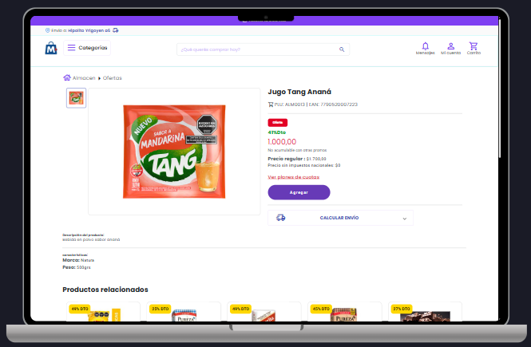
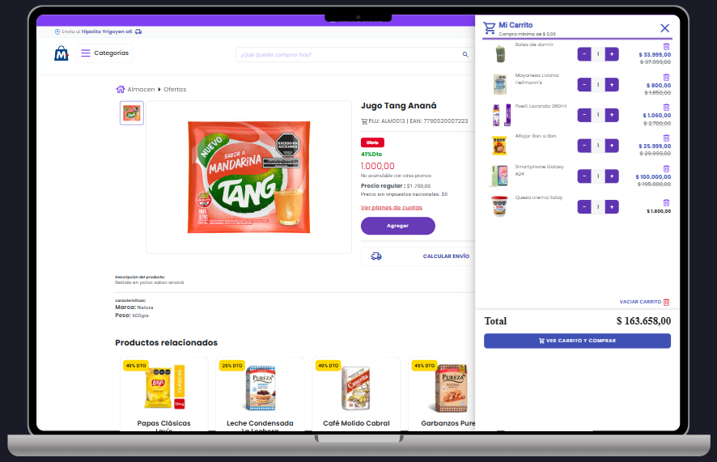
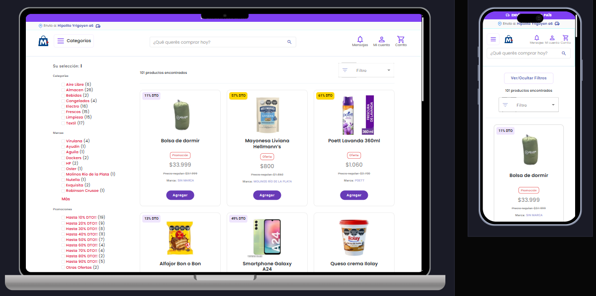

# Tu Tienda Online - Documentación

Documentación visual de la tienda online (Angular + Spring Boot).

---

## 🏠 Inicio

En esta sección se presentan los productos destacados junto con dos sliders totalmente configurables desde el panel de administración.  
El buscador principal permite filtrar los productos por **nombre, categoría, subcategoría, características, marcas** y otros criterios, ofreciendo una experiencia de búsqueda **dinámica y personalizada**.  

---

## 🧾 Detalle del Producto

En esta sección se muestra la información completa del producto seleccionado, incluyendo su **imagen, nombre, categoría, código, peso y precio actual**, así como sus características.  
Si el artículo cuenta con un descuento, se visualiza el **precio original tachado** junto con el **porcentaje de ahorro** correspondiente.  

El usuario puede **agregar el producto al carrito**, seleccionar la cantidad deseada y calcular el **costo del envío** directamente desde esta vista.  
Debajo, se presentan los **productos relacionados**, que se actualizan dinámicamente según la subcategoría o similitud del producto, permitiendo una **navegación fluida** entre artículos similares o complementarios.  

Además, la interfaz mantiene elementos clave de navegación como la **barra superior con el buscador**, las **opciones de cuenta** y el **acceso rápido al carrito**, brindando una experiencia de usuario coherente e intuitiva en todo el sitio.  

---

## 🛒 Carrito de Compras

En esta sección se listan todos los productos seleccionados por el usuario, mostrando su **imagen, nombre, precio actual, precio anterior en caso de descuento** y controles para **modificar la cantidad o eliminar artículos**.  
El carrito realiza una **validación dinámica del stock disponible** para evitar agregar productos que superen la cantidad permitida.  

También se muestra el **total de la compra** actualizado en tiempo real y un botón para continuar con el proceso de pago.  
La **dirección de envío** se obtiene automáticamente según la ubicación configurada por el usuario, permitiendo calcular costos de entrega antes de confirmar la compra.  

El sistema valida además un **importe mínimo de compra** que debe alcanzarse para habilitar la opción de finalizar el pedido.  
Se maneja la **concurrencia** para garantizar la consistencia de los datos en caso de múltiples usuarios realizando operaciones simultáneas, asegurando que los precios y cantidades se mantengan actualizados correctamente.  

---

## 🛍️ Sección de Búsqueda de Productos

En esta vista se muestran los **productos filtrados** según la búsqueda realizada.  
En la columna izquierda se listan las **coincidencias por marcas, categorías** y **productos con promociones**, destacando los descuentos según el porcentaje aplicado.  

Además, se incluye un **menú desplegable** que permite ordenar los productos por **precio** (mayor a menor o menor a mayor) y alfabéticamente (**de la A a la Z**).  

