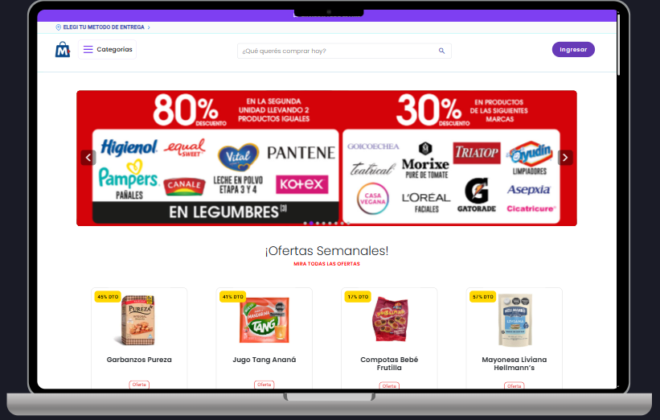

# Tu Tienda Online Documentación

Documentación visual de la tienda online (Angular + Spring Boot).

## 🏠 Inicio

En esta sección se presentan los productos destacados junto con dos sliders totalmente configurables desde el panel de administración. 
El buscador principal permite filtrar los productos por nombre, categoría, subcategoría, características, marcas y otros criterios, 
ofreciendo una experiencia de búsqueda dinámica y personalizada.

## 🧾 Detalle del Producto

 En esta sección se muestra la información completa del producto seleccionado, incluyendo su imagen, nombre, categoría, código, peso y precio actual y caracteristicas. Si el artículo cuenta con un descuento, se visualiza el precio original tachado junto con el porcentaje de ahorro correspondiente. 
 
 El usuario puede agregar el producto al carrito, seleccionar la cantidad deseada y calcular el costo del envío directamente desde esta vista. Debajo, se presentan los <strong>productos relacionados</strong>, que se actualizan dinámicamente según la subcategoría o similitud del producto, permitiendo una navegación fluida entre artículos similares o complementarios. 
 
 Además, la interfaz mantiene elementos clave de navegación como la barra superior con el buscador, las opciones de cuenta y el acceso rápido al carrito, brindando una experiencia de usuario coherente e intuitiva en todo el sitio. 

## 🛒 Carrito de Compras

 En esta sección se listan todos los productos seleccionados por el usuario, mostrando su imagen, nombre, precio actual, precio anterior en caso de descuento y controles para modificar la cantidad o eliminar artículos. El carrito realiza una validación dinámica del <strong>stock disponible</strong> para evitar agregar productos que superen la cantidad permitida. 
 
 También se muestra el <strong>total de la compra</strong> actualizado en tiempo real y un botón para continuar con el proceso de pago. La dirección de envío se obtiene automáticamente según la ubicación configurada por el usuario, permitiendo calcular costos de entrega antes de confirmar la compra. 
 
 El sistema valida además un <strong>importe mínimo</strong> de compra que debe alcanzarse para habilitar la opción de finalizar el pedido. Se maneja la <strong>concurrencia</strong> para garantizar la consistencia de los datos en caso de múltiples usuarios realizando operaciones simultáneas, asegurando que los precios y cantidades se mantengan actualizados correctamente. 

## 🛍️ Seccion busqueda de productos

En esta vista se muestran los <strong>productos filtrados</strong> según la búsqueda realizada. En la columna izquierda se listan las <strong>coincidencias</strong> por marcas, categorías y productos con promociones, destacando los descuentos según el porcentaje aplicado. Además, se incluye un menú desplegable que permite ordenar los productos por precio (mayor a menor o menor a mayor) y alfabéticamente (de la A a la Z).

